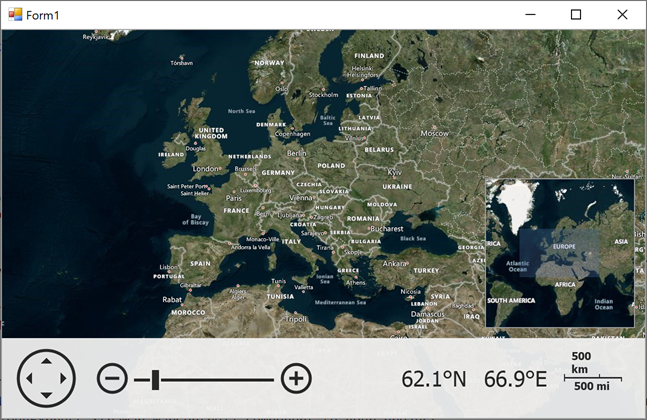

# Map for WinForms - Load Image Tiles From Bing Maps

This example shows how to load raster image tiles from the Bing Maps imagery service and add a [mini map](https://docs.devexpress.com/WindowsForms/17683/controls-and-libraries/map-control/visual-elements/mini-map?p=netframework) to the map.

Use the [BingMapDataProvider](https://docs.devexpress.com/WindowsForms/DevExpress.XtraMap.BingMapDataProvider?p=netframework) to load tiles from Bing Maps. You also need a key for working with Bing Maps. For instructions on how to register for a Bing Maps account and create a key for it, refer to the following help topic: [How to: Get a Bing Maps Key](https://docs.devexpress.com/WindowsForms/15102/controls-and-libraries/map-control/examples/general/how-to-get-a-bing-maps-key).

## Files to Look At

* [Form1.Designer.cs](./CS/WinForms_MapControl_Lesson1/Form1.Designer.cs) (VB: [Form1.Designer.vb](./VB/WinForms_MapControl_Lesson1/Form1.Designer.vb))

## Documentation

* [Lesson 1 - Load Image Tiles to a Map](https://docs.devexpress.com/WindowsForms/15098/controls-and-libraries/map-control/getting-started/lesson-1-connect-to-the-images-provider)
* [Map Image Data](https://docs.devexpress.com/WindowsForms/15080/controls-and-libraries/map-control/map-image-data)

## More Examples

* [Connect to the OpenStreetMap Service](https://github.com/DevExpress-Examples/winforms-map-connect-to-openstreetmap)
* [Use the Bing Maps Route Web Service to Calculate Routes from Major Roads](https://github.com/DevExpress-Examples/winforms-map-calculate-routes-from-major-roads)
* [Create a Data Provider to Load Image Tiles from a Custom Source](https://github.com/DevExpress-Examples/winforms-map-load-image-tiles-from-custom-source)
* [Obtain Information About a Geographical Point from the Microsoft Bing Geocode Web Service](https://github.com/DevExpress-Examples/winforms-map-get-geo-point-info-from-bing-geocode-service)
* [Calculate a Route Between Two Addresses](https://github.com/DevExpress-Examples/how-to-calculate-a-route-between-two-addresses-t364143)
* [Calculate a route between waypoints and customize the appearance of a route path using a Microsoft Bing Maps Route web service](https://github.com/DevExpress-Examples/how-to-calculate-a-route-between-waypoints-and-customize-the-appearance-of-a-route-path-usin-e5100)
